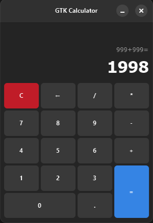

# GTK Calculator

A simple calculator application built with the GTK4 toolkit and Libadwaita in C.



*(Note: Screenshot may not reflect the latest UI changes)*

## Features

*   Basic arithmetic operations: Addition, Subtraction, Multiplication, Division (includes handling for division by zero).
*   Graphical user interface built with GTK4 and Libadwaita.
*   Uses CMake for building.
*   Uses vcpkg for dependency management.
*   Supports standard C entry points (`main`) and hides the console window on Windows Release builds (`WinMain`).
*   Includes Windows application manifest (`app_manifest.rc`) for metadata and icon.

## Dependencies

*   **A C Compiler:** Such as GCC, Clang, or MSVC.
*   **CMake:** Build system generator.
*   **vcpkg:** C/C++ library manager.
*   **Ninja:** Build tool (optional, but used via vcpkg).
*   **GTK4:** The core GUI toolkit.
*   **GLib:** A fundamental utility library (comes with GTK).
*   **Libadwaita:** Library providing Adwaita widgets and styles for GTK4 applications.

The project requires the dependencies listed in `vcpkg.json` (not shown, but referenced by CMake). These include at least `gtk` and `libadwaita` as explicitly linked in `CMakeLists.txt`. Other vcpkg helper packages like `pkgconf` may also be required depending on your `vcpkg.json`.
## Building

This project uses CMake and vcpkg for dependency management.

1.  **Clone the repository:**
    ```bash
    git clone <repository-url>
    cd <repository-directory-name>
    ```

2.  **Ensure vcpkg is integrated or provide the toolchain file:**
    Make sure you have vcpkg installed. The simplest way is often to let CMake find it via the toolchain file. You can check your `vcpkg-configuration.json` for registry details if needed.

3.  **Configure the build using CMake:**
    Replace `[path-to-vcpkg]` with the actual path to your vcpkg installation's `scripts/buildsystems/vcpkg.cmake` file.
    ```bash
    # Create a build directory
    cmake -B build -S . -DCMAKE_TOOLCHAIN_FILE=[path-to-vcpkg]/scripts/buildsystems/vcpkg.cmake
    ```
    *   Specify a build type (e.g., Debug or Release). Release is recommended for distribution:
        ```bash
        cmake -B build -S . -DCMAKE_TOOLCHAIN_FILE=[path-to-vcpkg]/scripts/buildsystems/vcpkg.cmake -DCMAKE_BUILD_TYPE=Release 
        ```
    *   As configured in `CMakeLists.txt`, Windows Release builds will use `WinMain` (hiding the console window) and link against `app_manifest.rc`.

4.  **Build the project:**
    ```bash
    cmake --build build
    ```
    Or using Ninja directly if configured:
    ```bash
    cd build
    ninja
    ```

## Running

The executable will be placed in the `bin` directory within your build folder (e.g., `build/bin/`).

*   **Linux/macOS:**
    ```bash
    ./build/bin/gtk_calculator
    ```
*   **Windows:**
    ```bash
    .\build\bin\gtk_calculator.exe
    ```

## Notes

*   The specific functions for loading UI definitions (e.g., from a `.ui` file via `GtkBuilder`) or custom CSS themes are likely located within `src/Application.c` (not fully provided).
*   Previous versions might have set environment variables like `GTK_CSD` or `GTK_DEBUG` directly in `src/main.c`, but these are currently commented out in the provided snippet. Configuration might happen elsewhere or use default settings.
*   The `app_manifest.rc` file defines Windows-specific properties like the program description, version ("1.2.0"), and icon (`differ_icon.ico`).

## Contributing

Contributions are welcome! Please open an issue or submit a pull request.

## License

This project is licensed under the [LGPL-3.0-or-later](https://spdx.org/licenses/LGPL-3.0-or-later.html) - see the [LICENSE](LICENSE.md) file for details.