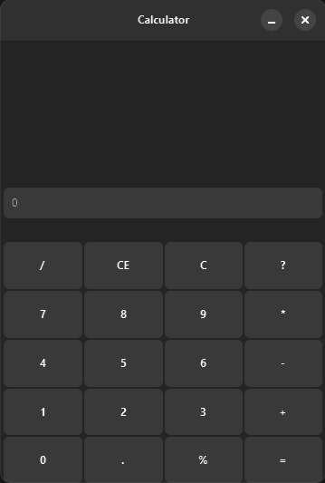

# GTK Calculator

A simple calculator application built with the GTK4 toolkit in C.



## Features

*   Basic calculator functionality (details depend on `Calculator.c`, which wasn't provided).
*   Graphical user interface built with GTK4.
*   Uses CMake for building.
*   Uses vcpkg for dependency management.
*   Supports standard C entry points (`main`) and hides the console window on Windows Release builds (`WinMain`).

## Dependencies

*   **GTK4:** The core GUI toolkit.
*   **GLib:** A fundamental utility library (comes with GTK).
*   **CMake:** Build system generator.
*   **A C Compiler:** Such as GCC, Clang, or MSVC.
*   **Ninja:** Build tool (optional, but used via vcpkg).
*   **vcpkg:** C/C++ library manager.

The project requires the dependencies listed in `vcpkg.json`: `gtk`, `pkgconf`, `vcpkg-pkgconfig-get-modules`, `vcpkg-tool-ninja`, and potentially `libadwaita` (though linking is commented out in `CMakeLists.txt`).

## Building

This project uses CMake and vcpkg for dependency management.

1.  **Clone the repository:**
    ```bash
    git clone <repository-url>
    cd <repository-directory-name>
    ```

2.  **Ensure vcpkg is integrated or provide the toolchain file:**
    Make sure you have vcpkg installed. The simplest way is often to let CMake find it via the toolchain file.

3.  **Configure the build using CMake:**
    Replace `[path-to-vcpkg]` with the actual path to your vcpkg installation.
    ```bash
    # Create a build directory
    cmake -B build -S . -DCMAKE_TOOLCHAIN_FILE=[path-to-vcpkg]/scripts/buildsystems/vcpkg.cmake
    ```
    *   You can specify a build type (e.g., Debug or Release): `-DCMAKE_BUILD_TYPE=Release`
    *   On Windows, Release builds will use `WinMain` and hide the console window (as configured in `CMakeLists.txt`).

4.  **Build the project:**
    ```bash
    cmake --build build
    ```
    Or using Ninja directly if configured:
    ```bash
    cd build
    ninja
    ```

## Running

The executable will be placed in the `bin` directory within your build folder (e.g., `build/bin/`).

*   **Linux/macOS:**
    ```bash
    ./build/bin/gtk_calculator
    ```
*   **Windows:**
    ```bash
    .\build\bin\gtk_calculator.exe
    ```

## Notes

*   The application UI might be loaded from a `.ui` file via `app_load_ui_from_file` defined in `src/Application.c`, but the specific UI file isn't shown.
*   The application theme might be loaded via `app_load_theme_from_file` defined in `src/Application.c`.
*   The `GTK_CSD=0` environment variable is set in `src/main.c`, which likely forces server-side (native) window decorations instead of GTK's client-side decorations.

## Contributing

Contributions are welcome! Please open an issue or submit a pull request. (Consider adding more specific contribution guidelines).

## License

This project is licensed under the [LGPL-3.0-or-later](https://spdx.org/licenses/LGPL-3.0-or-later.html) - see the [LICENSE](LICENSE.md) file for details.